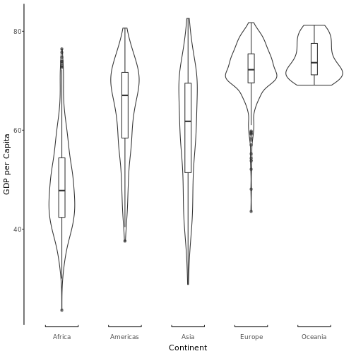
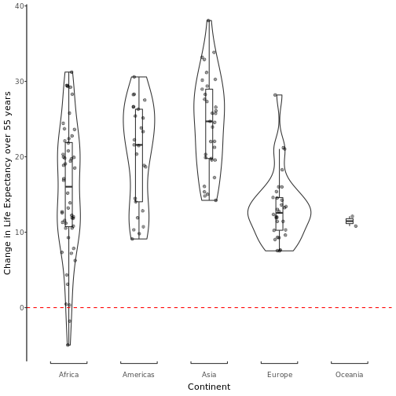
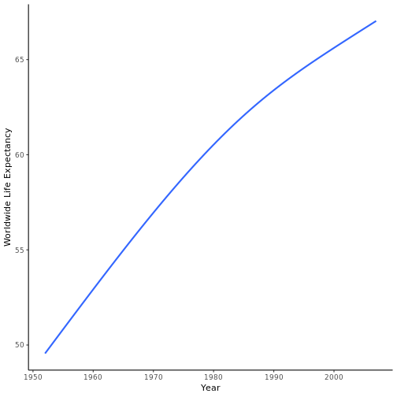
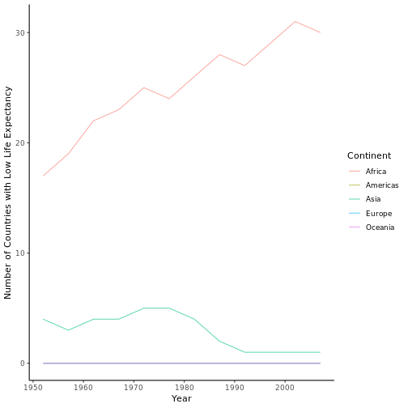

In this assignment, I will be using `dplyr` and `ggplot2` to tackle three data manipulation tasks on the `gapminder` dataset. Each task will result in a table and plot.


## Task 1: Spread of GDP per Capita by Continent

How does GDP per Capita vary by continent? To answer this questions we first need to decide on how we plan to talk about the spread of data.

Maximum and minimum values give us a good idea of the range of the data, but not how the data is distributed within it. Quartiles do a better job of describing the spread, but can be insensitive to infrequent outliers. The mean is another option for describing the central tendency, and along with the median can give you an idea of the skew of the distribution. It should come as no suprise then that these are statistics reported by the `summary()` function.

Let's use these functions to build a table:


```r
gapminder %>%
  group_by(continent) %>%
  summarize( # Here is where we calculate all the stats we want in the table
    Min = min(lifeExp),
    Quartile1 = quantile(lifeExp, 0.25),
    Median = quantile(lifeExp, 0.5),
    Mean = mean(lifeExp),
    Quartile3 = quantile(lifeExp, 0.75),
    Max = max(lifeExp)
  ) %>%
  kable
```


|continent |    Min| Quartile1|  Median|     Mean| Quartile3|    Max|
|:---------|------:|---------:|-------:|--------:|---------:|------:|
|Africa    | 23.599|  42.37250| 47.7920| 48.86533|  54.41150| 76.442|
|Americas  | 37.579|  58.41000| 67.0480| 64.65874|  71.69950| 80.653|
|Asia      | 28.801|  51.42625| 61.7915| 60.06490|  69.50525| 82.603|
|Europe    | 43.585|  69.57000| 72.2410| 71.90369|  75.45050| 81.757|
|Oceania   | 69.120|  71.20500| 73.6650| 74.32621|  77.55250| 81.235|

However, these methods are less informative if the distribution is bimodal or more complicated still. Luckily plotting data is a less sensitive to this assumption.


```r
gapminder %>%
  ggplot(aes(continent, lifeExp)) +
    geom_violin() +
    geom_boxplot(width = 0.1, outlier.alpha = 0.6) + # too many points to plot, just plot outliers
    labs(x = "Continent", y = "GDP per Capita") +
    coord_flex_cart(                                 # This section adds bracketed x-axes, which I like
                                                     # From the package `lemon`
      bottom=brackets_horisontal()
    ) +
  theme_classic() +                                  #Main Theme
  theme(
    axis.text.x = element_text(vjust = -2.5),        #Adjust x-axis tick labels down
    axis.title.x = element_text(margin = margin(t = 15)) #Adjust x-axis title down
  )
```



## Task 2: How is life expectancy changing over time?

In asking how life expectancy changes over time by continent, it is first necessary to choose a way of summarising the change within each country and then putting it together within each continent. An obvious but simplistic solution is to find the median change in life expectancy from the first sampled year (1952) to the last (2007) across each continent. Although this glosses over many interesting details, it has the benefit of being quite readable as a table.


```r
change <- gapminder %>%
  group_by(continent, country) %>%
  arrange(year) %>% # Ensure years are in chronological order before comparing firsts to lasts
  summarise(change = last(lifeExp) - first(lifeExp))

change %>%
  summarise(median_change = median(change),
            mean_change = mean(change),
            countries_sampled = n()) %>%
  kable
```


|continent | median_change| mean_change| countries_sampled|
|:---------|-------------:|-----------:|-----------------:|
|Africa    |       16.0270|    15.67054|                52|
|Americas  |       21.5760|    20.32828|                25|
|Asia      |       24.6960|    24.41409|                33|
|Europe    |       12.5595|    13.24010|                30|
|Oceania   |       11.4645|    11.46450|                 2|

```r
change %>%
  ggplot(aes(continent, change)) +
    geom_violin() +
    geom_boxplot(width = 0.1, outlier.shape = NA) + # Since there aren't many points, let's plot them all
    geom_jitter(width = 0.1, alpha = 0.4) +
    labs(x = "Continent", y = "Change in Life Expectancy over 55 years") +
    coord_flex_cart(                                # As before, for the bracketed axis
      bottom=brackets_horisontal()
    ) +
  geom_hline(yintercept = 0, linetype = "dashed", color = "red") +
  theme_classic() +                                 # As before, for theming and minor adjustments
  theme(
    axis.text.x = element_text(vjust = -2.5),
    axis.title.x = element_text(margin = margin(t = 15))
  )
```



From just this, we can see that life expectancy on average went up in all continents and that Africa was the only continent to see decreases in life expectancy in some countries over this time range.

## Task 3: Number of countries with low life expectancy

It is clear that what is considered normal for life expectancy is changing over time. Even over the relatively short period sampled in the gapminder dataset, this worldwide this change is quite evident:



So how then do you determine a yearly benchmark for low life expectancy? One option is to look for outliers. For this task, I will take an outlier to be a country with life expectancy that is more than one standard deviations below the yearly worldwide average. I will then find the number of countries in this category by year and continent.


```r
low_lifeExp <- gapminder %>%
  group_by(year) %>%
  mutate(life_bench = mean(lifeExp) - sd(lifeExp), # First we calculate our benchmark for life expectancy,
         low_exp = lifeExp < life_bench) %>%       # then check which countries meet the criteria
  group_by(continent, year) %>%
  summarise(low = sum(low_exp)) #Notice that low_exp is a boolean, we can sum those to count the number of true's!

low_lifeExp %>%
  spread(year, low) %>%
  rename(Continent = continent) %>%
  kable(caption = "The number of countries with low life expectancy by year and continent")
```


|Continent | 1952| 1957| 1962| 1967| 1972| 1977| 1982| 1987| 1992| 1997| 2002| 2007|
|:---------|----:|----:|----:|----:|----:|----:|----:|----:|----:|----:|----:|----:|
|Africa    |   17|   19|   22|   23|   25|   24|   26|   28|   27|   29|   31|   30|
|Americas  |    0|    0|    0|    0|    0|    0|    0|    0|    0|    0|    0|    0|
|Asia      |    4|    3|    4|    4|    5|    5|    4|    2|    1|    1|    1|    1|
|Europe    |    0|    0|    0|    0|    0|    0|    0|    0|    0|    0|    0|    0|
|Oceania   |    0|    0|    0|    0|    0|    0|    0|    0|    0|    0|    0|    0|

```r
low_lifeExp %>%
  ggplot(aes(year, low, colour = continent)) +
    geom_line(alpha = 0.6) +
    labs(x = "Year",
         y = "Number of Countries with Low Life Expectancy",
         colour = "Continent") +
    theme_classic()
```



From this, we can see that Africa has the greatest number of countries with low life expectancy (by this definition), followed by Asia. While the number of countries with low life expectancy in Asia appears to have decreased and stabilized, the number of countries with low life expectancy appears to be growing. From this plot alone, it is unclear if life expectancy is decreasing in these countries in Africa or if they are just being out paced by the rest of the world.
